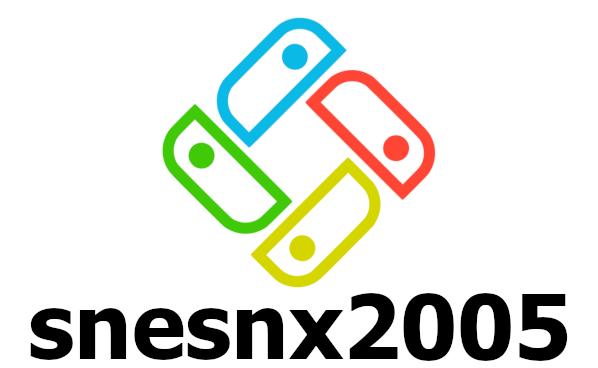
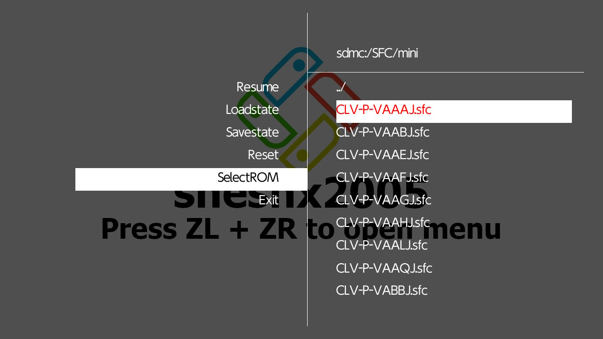
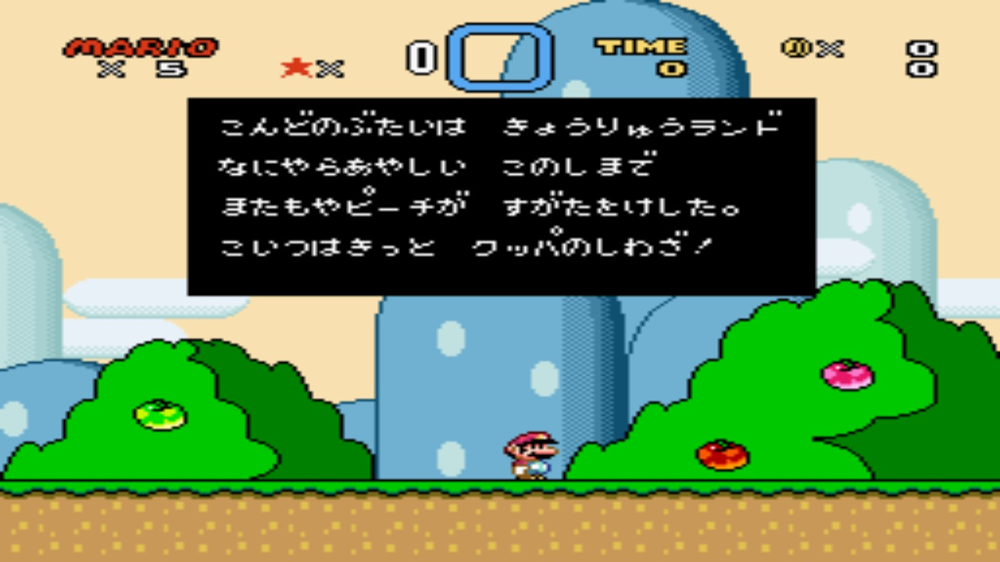
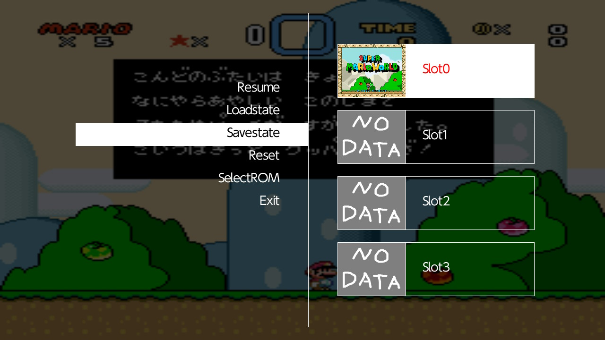

 

A bad port of [snes9x2005](https://github.com/libretro/snes9x2005/) libretro core for Nintendo Switch.

Snes9x is a Super Nintendo Entertainment System emulator.

# issues

 * SA-1 not working
 * `Exit` causes a crash.
 * Only 1P can play.

# snapshots

